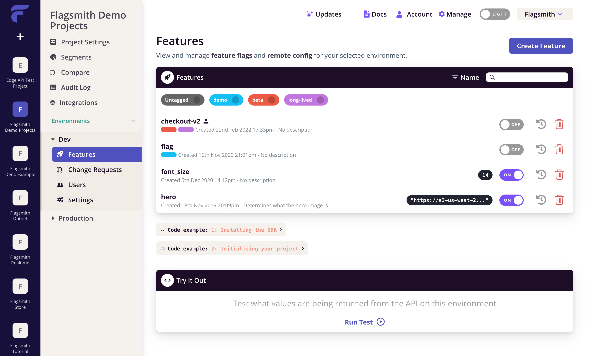

# Flagsmith CI/CD pipeline

Deploy Flagsmith server with CI/CD on Elestio

 
 

# Once deployed ...

You can open Flagsmith UI here:

    URL: https://[CI_CD_DOMAIN]
    email: [ADMIN_EMAIL]
    password: [ADMIN_PASSWORD]

# Admin

You can open Django administration here:

    URL: https://[CI_CD_DOMAIN]/admin/
    email: [ADMIN_EMAIL]
    password: [ADMIN_PASSWORD]

# Documentation

https://docs.flagsmith.com/quickstart
